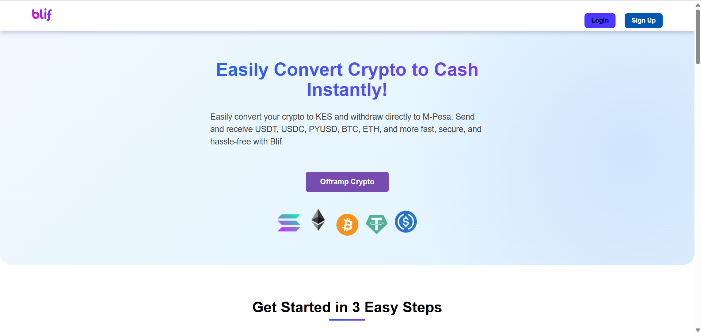

# 💸 Crypto Offramping Frontend  

A React-based application for seamless conversion of cryptocurrencies to local fiat currencies, focusing on regions like Sub-Saharan Africa. Provides secure, user-friendly transactions between digital assets and traditional banking systems.  




## 🚀 Features  
- **User-Friendly Interface**: Intuitive design for effortless navigation.  
- **Secure Transactions**: Robust encryption and auth protocols.  
- **Real-Time Updates**: Live exchange rates and transaction statuses.  
- **Responsive Design**: Works on desktop, tablet, and mobile.  

---

## 🛠️ Tech Stack  
| Category           | Technologies                |  
|--------------------|-----------------------------|  
| Frontend           | React.js + Vite             |  
| Styling            | Tailwind CSS                |  
| State Management   | Redux Toolkit               |  
| Routing            | React Router v6             |  
| API Client         | Axios                       |  

---

## 📁 Project Structure  
Crypto_offramping-frontend/
├── public/ # Static assets
├── src/
│ ├── assets/ # Images/icons
│ ├── components/ # Reusable UI (Buttons, Cards)
│ ├── pages/ # Route components
│ ├── services/ # API/services
│ ├── store/ # Redux slices
│ ├── App.jsx # Root component
│ └── main.jsx # Entry point
├── .gitignore
├── package.json
└── config files (vite/tailwind)


---

## ⚙️ Installation  
1. Clone the repo:  
   ```bash  
   git clone https://github.com/emmanuelronoh/Crypto_offramping-frontend.git  
   cd Crypto_offramping-frontend  
2. Install dependencies:
   ```bash
   npm install 
   ```
3. Start dev server:
   ```bash
   npm run dev  
   ```
Live URL: http://localhost:5173

## 📦 Deployment (Vercel)

1. Install Vercel CLI:
```bash
npm install -g vercel  
```

Deploy:
vercel 
 
Follow interactive prompts.

## 🧪 Testing (To be implemented)

```bash
npm test  
```
## 📄 License
License
MIT License
Copyright (c) 2025 Emmanuel Kipkirui
Permission is hereby granted, free of charge, to any person obtaining a copy
of this software and associated documentation files (the "Software"), to deal
in the Software without restriction, including without limitation the rights
to use, copy, modify, merge, publish, distribute, sublicense, and/or sell
copies of the Software, and to permit persons to whom the Software is
furnished to do so, subject to the following conditions:
The above copyright notice and this permission notice shall be included in all
copies or substantial portions of the Software.
THE SOFTWARE IS PROVIDED "AS IS", WITHOUT WARRANTY OF ANY KIND, EXPRESS OR
IMPLIED, INCLUDING BUT NOT LIMITED TO THE WARRANTIES OF MERCHANTABILITY,
FITNESS FOR A PARTICULAR PURPOSE AND NONINFRINGEMENT. IN NO EVENT SHALL THE
AUTHORS OR COPYRIGHT HOLDERS BE LIABLE FOR ANY CLAIM, DAMAGES OR OTHER
LIABILITY, WHETHER IN AN ACTION OF CONTRACT, TORT OR OTHERWISE, ARISING FROM,
OUT OF OR IN CONNECTION WITH THE SOFTWARE OR THE USE OR OTHER DEALINGS IN THE
SOFTWARE.
MIT

## 🤝 Contributing
1. Fork the project

2. Create a branch (git checkout -b feature/xyz)

3. Commit changes (git commit -m 'Add feature')

4. Push (git push origin feature/xyz)

5. Open a PR

## Guidelines:

Follow existing code style

Add tests for new features

Update documentation